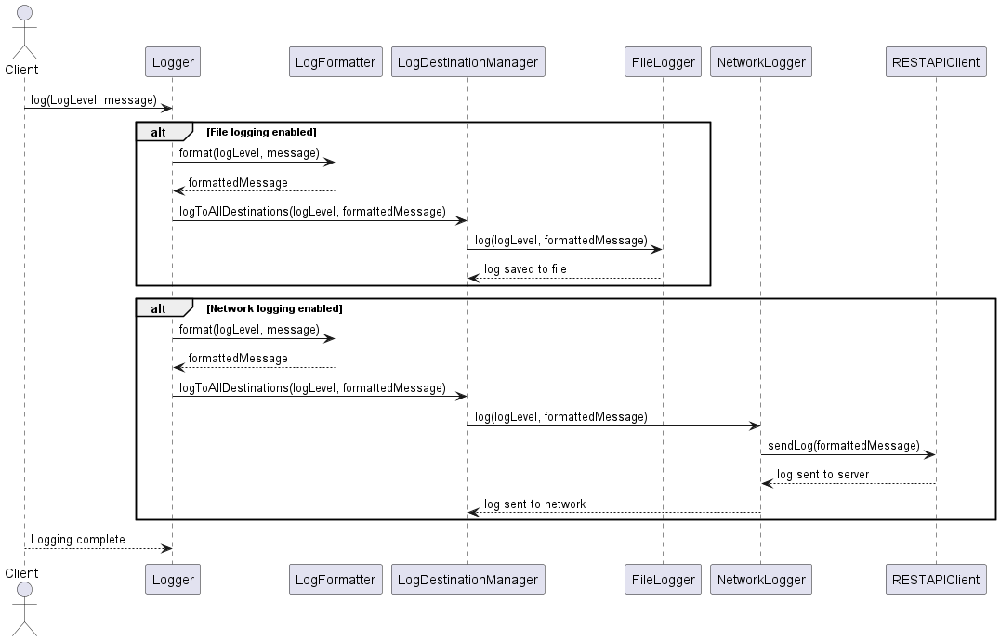
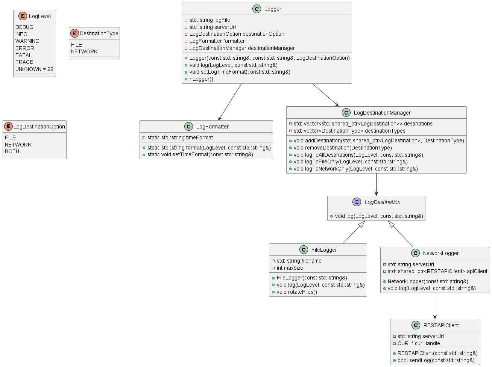

# Logger library documentation

## Opis glownych funkcjonalnosci logger_library wraz z diagramem sekwencji.
Biblioteka Logger library służy do zarządzania procesem logowania wiadomości w aplikacjach. Umożliwia logowanie do różnych destynacji,
takich jak plik lub serwer sieciowy, za pomocą klas takich jak FileLogger i NetworkLogger. Obsługuje różne poziomy logowania (LogLevel),
takie jak DEBUG, INFO, ERROR, i pozwala na formatowanie logów za pomocą klasy LogFormatter, która dodaje do logów datę, czas oraz poziom logowania.

Główna klasa Logger zarządza logowaniem, a LogDestinationManager kontroluje, do których destynacji są wysyłane logi.
Logi mogą być przesyłane zarówno do pliku lokalnego, jak i na serwer sieciowy jednocześnie (lub tylko do jednej z tych opcji).
NetworkLogger korzysta z klienta RESTAPIClient, który wysyła logi na zewnętrzny serwer za pomocą żądań HTTP.
Biblioteka wspiera także rotację plików logów w przypadku, gdy ich rozmiar przekracza określony limit.

## Opis klas Logger library

### Logger
Klasa zarządzająca całym procesem logowania. Umożliwia logowanie na różne destynacje, takie jak plik lub serwer sieciowy. Wykorzystuje `LogFormatter` do formatowania wiadomości i `LogDestinationManager` do zarządzania miejscami, do których trafiają logi.

### LogFormatter
Klasa odpowiedzialna za formatowanie wiadomości logów. Działa na zasadzie statycznych metod, które formatują wiadomości zgodnie z określonym poziomem logowania oraz ustalonym formatem czasu.

### LogDestinationManager
Klasa zarządzająca miejscami, do których są wysyłane logi. Przechowuje różne destynacje (np. plik, sieć) i umożliwia logowanie do wszystkich destynacji jednocześnie lub do wybranej.

### LogDestination (Interfejs)
Interfejs dla różnych typów destynacji logowania. Każda destynacja musi zaimplementować metodę `log`, która odbiera wiadomości logów w odpowiedni sposób.

### FileLogger
Klasa implementująca logowanie do pliku. Sprawdza rozmiar pliku i automatycznie go rotuje, jeśli przekracza określony limit.

### NetworkLogger
Klasa implementująca logowanie do serwera poprzez sieć. Wysyła logi do zewnętrznego serwera, używając klienta REST (klasy `RESTAPIClient`).

### RESTAPIClient
Klasa do obsługi komunikacji z serwerem REST. Wykorzystuje bibliotekę `curl` do wysyłania zapytań HTTP POST, które przekazują wiadomości logów na serwer.

## Testy

Testy jednostkowe w Logger library mają na celu sprawdzenie poprawności działania poszczególnych komponentów systemu logowania. Każdy test sprawdza określone zachowanie, takie jak:

- FileLogger: Testy sprawdzają, czy logi są poprawnie zapisywane do pliku, czy działa mechanizm rotacji plików po przekroczeniu maksymalnego rozmiaru oraz jak system reaguje na niepoprawne ścieżki plików.
- LogDestinationManager: Weryfikuje dodawanie i usuwanie destynacji logowania oraz prawidłowe przekazywanie logów do wybranych destynacji (np. tylko do pliku).
- LogFormatter: Sprawdza, czy formatowanie logów z odpowiednim poziomem logowania i ustawionym formatem czasu działa zgodnie z oczekiwaniami.
- LogLevel: Testy sprawdzają poprawność mapowania poziomów logowania na odpowiednie ciągi tekstowe (INFO, ERROR, itp.).
- Logger: Weryfikuje poprawność logowania do pliku, sieci oraz obu destynacji jednocześnie.

Testy są realizowane przy użyciu frameworków Google Test oraz Google Mock, aby zapewnić, że wszystkie funkcjonalności są dobrze izolowane i testowane niezależnie

---

## Building environment

### Auto build using docker-compose

1. Build image:  
   1.1 `docker-compose build`

   1.2 `docker-compose up`

2. Enter to running container:  
   2.1 `docker ps`   
   2.2 Logger library:  
   `docker exec -it logger_library-logger_library-1 /bin/bash`  
   2.3 Python server:  
   `docker exec -it logger_library-log_server /bin/bash`  

1. Rebuild container after changes in docker-compose file:  
   `docker-compose up --build`

### Create Network for connection between logger_library and python server

1. Create network:  
   `docker network create log_network`

### Build logger_library_image
1. Build image:  
   `docker build -t logger_library_env:1 .`

2. *Optional* - Run container:  
   `docker run --name logger_library_container --mount type=bind,source="$(pwd)",target=/logger_library -it logger_library_env:1`

3. Run container with network option:  
   `docker run --name logger_library_container --network log_network --mount type=bind,source="$(pwd)",target=/logger_library -it logger_library_env:1`

4. *Optional* Running container:  
   `docker start -i logger_library_container`

5. *Optional* Stopping container:  
   `docker stop logger_library_container`

6. *Optional* Enter to running container:  
   `docker exec -it <container_name/container_id> /bin/bash `

### Create python server
1. Build image with python server:  
   Go to log_server directory and then type:  
   `docker build -t log_server_image .`

2. Run container with network option for python server:  
   `docker run -d --name log_server --network log_network -p 8090:8090 log_server_image`

3. Enter to running container:  
   `docker exec -it log_server /bin/bash `

Python server is running on port 8090 automatically after running container

### Run tests
1. After running container logger_library_container:  
2. Type `./run_test.sh` to run tests

### Run main file
1. Type `./run_exec.sh` to run main file - testing on Warehouse model
2. After running all application checkout to second console and type `cat log.txt` to see output of application
3. To see output in local file see `warehouse_log.txt`